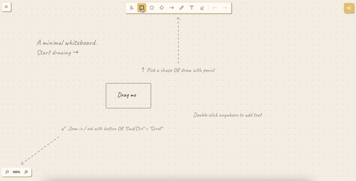
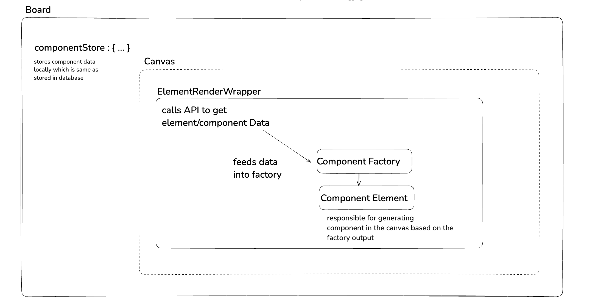

# Craftbase

A minimal online whiteboard you can open and start drawing on. No signup, no setup, no empty-state tutorial to click through — the canvas is just there waiting.

**Try it: [craftbase.org](https://craftbase.org)**

<!--
    Demo GIF goes here. Record a short loop (10–15s) of opening the board and
    sketching a few shapes + some pencil strokes, then drop it at the path below.
    A moving picture sells this far better than any paragraph can.
-->



## What it is

I wanted a whiteboard that gets out of the way. Most tools make you sign in, pick a template, or learn their toolbar before you can think. Craftbase opens straight onto a blank canvas — you draw shapes, scribble with the pencil, drop some text, connect things with arrows, and that's the whole pitch. You're brainstorming within a couple of seconds of the page loading.

Things you can do on a board:

- Sketch with shapes (rectangle, circle, diamond), the freehand pencil, arrows or erase with rubber
- Drop text anywhere, including text that lives inside a shape
- Pan and zoom around an infinite canvas
- Style what you draw — stroke, fill, width, dashes, color, opacity
- Undo your way back out of mistakes
- Share a board with a link

Live collaboration is built but currently turned off behind a flag while I finish hardening it. Once it's on, you'll be able to share a board and draw on it together in real time.

A fair warning: I work on this mostly on weekends, so expect the occasional bug or rough edge. If you hit one — or have an idea, or just want a feature — please [open an issue](https://github.com/craftbase-org/craftbase/issues). I read all of them.

## Craftbase as an embeddable whiteboard

Craftbase isn't only the app at craftbase.org. The `Board` is a self-contained, embeddable whiteboard component, and other apps consume it as a library.

If you want to embed a canvas in your own app, the public surface lives in `src/lib.ts` (`Board`, `BoardContext`, the hooks, bootstrap helpers). `Board` takes optional extension props like `renderBackground`, `onCameraChange`, and `scaleToDisplay` so you can layer your own content underneath and react to the camera without forking anything.

## How it's built



Craftbase renders its canvas with [two.js](https://github.com/jonobr1/two.js), a lovely 2D scene-graph library by [Jono Brandel](https://github.com/jonobr1). Two.js draws the scene; React drives the UI and state around it.

The central concept is the **Board**. It owns the canvas, the sidebar, and the floating toolbar. Rendering flows down a small chain:

```
Board → Canvas → ElementRenderer → Component Element → Component Factory
```

Canvas holds the 2D rendering logic and all the interaction handling — mouse, drag, zoom, pan — which is what makes a board feel alive to draw on. Each kind of element (a shape, an arrow, a pencil stroke) has a **factory** that produces its template definition, and a matching React **component** that mounts it into the scene and wires up its event listeners.

State is shared through React Context (`BoardContext`) rather than a global store. The stack is React + TypeScript, Vite for the build, Two.js for rendering, and Apollo + Hasura (GraphQL) for the backend.

## Running it locally

Craftbase is the frontend. The backend lives in a separate repo, [craftbase-hasura](https://github.com/craftbase-org/craftbase-hasura), under the same org. You'll need both running to use the full app locally.

### Backend

Follow the setup steps in the [craftbase-hasura README](https://github.com/craftbase-org/craftbase-hasura) to get the backend running.

### Frontend

Clone this repo and install dependencies:

```bash
yarn
```

Create a `.env` file in the project root and copy the contents of `.envexample` into it.

Then start the dev server:

```bash
yarn start
```

This runs Vite and serves the app at [http://localhost:5173](http://localhost:5173). The page hot-reloads as you edit, and type/lint errors show up in your terminal.

Other useful scripts:

```bash
yarn build       # production build into ./dist
yarn preview     # serve the production build locally
yarn typecheck   # tsc --noEmit
yarn test        # unit tests (vitest)
yarn test:e2e    # end-to-end tests (playwright)
```

## Contributing

Issues and pull requests are welcome — features, suggestions, and bug reports all count. It's a weekend project, so I appreciate the patience and the company.
